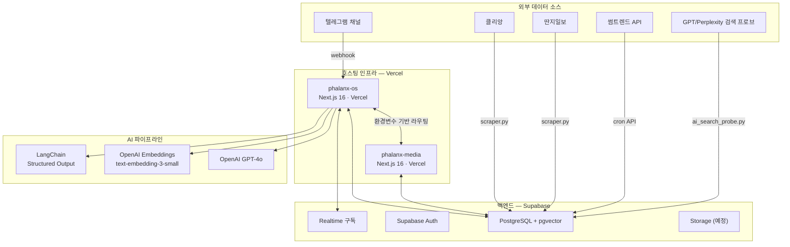
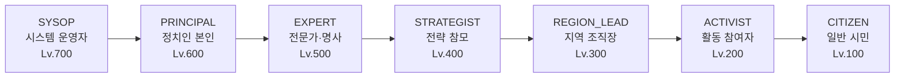
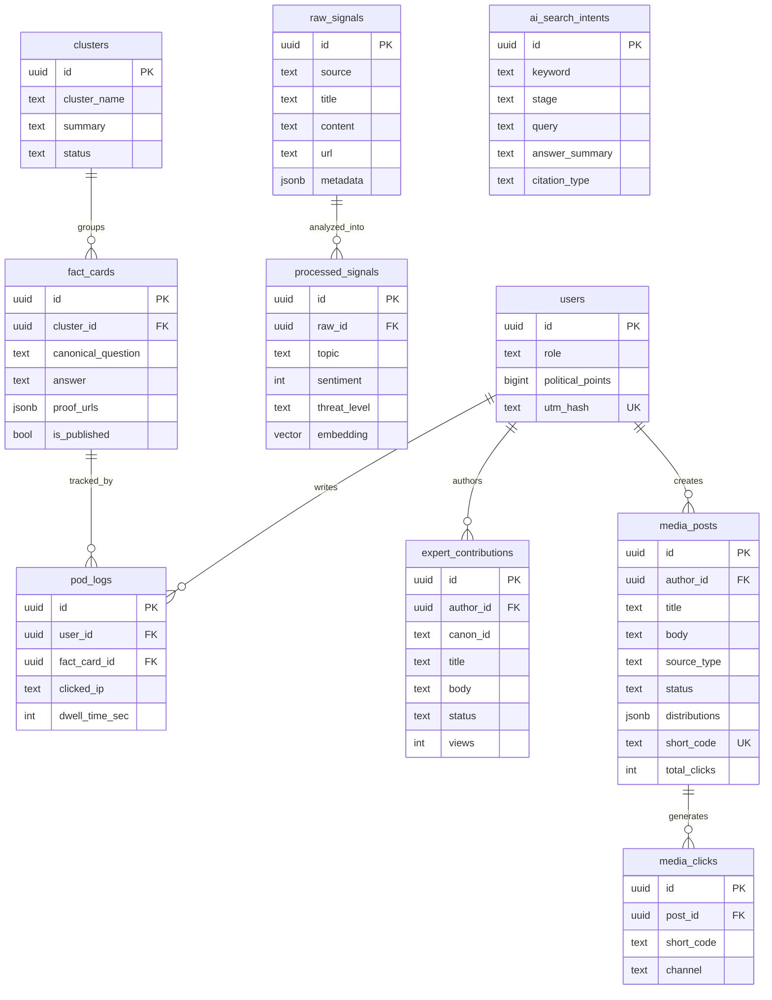
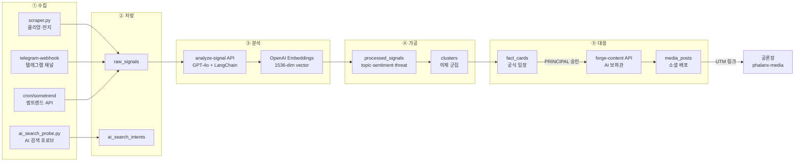
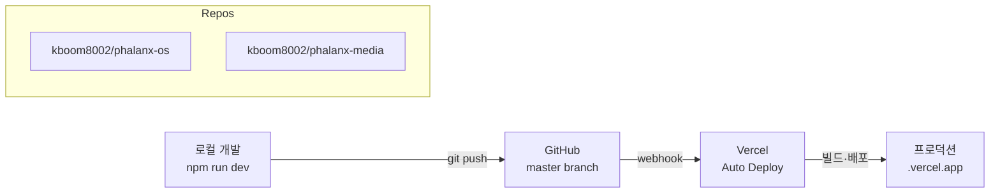

# Phalanx 시스템 아키텍처 (SDD)

> **문서 버전:** 1.0 | **기준일:** 2026-05-01
> **범위:** phalanx-os + phalanx-media 전체 생태계

---

## 1. 시스템 전체 구조



---

## 2. 서비스 분리 아키텍처

| 구분 | phalanx-os | phalanx-media |
|:-----|:-----------|:-------------|
| **역할** | 운영 시스템 (Internal) | 공개 미디어 (Public) |
| **대상** | SYSOP ~ ACTIVIST (운영진+참여자) | CITIZEN + 일반 시민 (비로그인 포함) |
| **프레임워크** | Next.js 16.2.4 (Turbopack) | Next.js 16.x |
| **배포** | Vercel (`phalanx-os.vercel.app`) | Vercel (`phalanx-media.vercel.app`) |
| **DB** | Supabase (직접 연결) | Supabase (읽기 전용 + API 경유) |
| **인증** | auth-context (7단계 RBAC) | 미인증 공개 접근 |
| **연동** | `NEXT_PUBLIC_MEDIA_URL` → media | `NEXT_PUBLIC_OS_URL` → os |

```
┌──────────────────────┐          ┌──────────────────────┐
│   phalanx-os         │  ←────→  │   phalanx-media      │
│                      │  env var │                      │
│  운영·분석·배포 센터  │  routing │  공론장·Canon·전문가  │
│  (Internal Ops)      │          │  (Public Facing)     │
└──────────┬───────────┘          └──────────┬───────────┘
           │                                 │
           └──────────┬──────────────────────┘
                      │
              ┌───────▼────────┐
              │   Supabase     │
              │  PostgreSQL    │
              │  + pgvector    │
              │  + Realtime    │
              └────────────────┘
```

---

## 3. 역할 기반 접근 제어 (RBAC)

### 3-A. 7단계 역할 계층



### 3-B. 역할별 접근 범위

| 역할 | 접근 가능 경로 | 핵심 권한 |
|:-----|:-------------|:---------|
| SYSOP (700) | `/admin/*`, 전체 | 모든 기능, DB 관리, 역할 변경 |
| PRINCIPAL (600) | `/principal`, `/admin/*` | 팩트카드 최종 승인/반려, 여론 열람 |
| EXPERT (500) | `/expert`, `/media` | 기고 작성, 미디어 배포 |
| STRATEGIST (400) | `/admin/*` | 여론 분석, 과제 발행, 기고 검토 |
| REGION_LEAD (300) | `/commander`, `/media` | 지역 참여자 관리, 미디어 배포 |
| ACTIVIST (200) | `/v-dash`, `/media` | 과제 수행, 미디어 배포, 점수 |
| CITIZEN (100) | phalanx-media only | 공론장 열람 (OS 접근 차단) |

### 3-C. 인증 흐름

```
브라우저 → proxy.ts (미들웨어)
              │
              ├── cookie: mock_role 검사
              ├── ?auth=vg → ACTIVIST 쿠키 발급 → /v-dash
              ├── ?auth=exp → EXPERT 쿠키 발급 → /expert
              ├── ?auth=principal → PRINCIPAL 쿠키 발급 → /principal
              └── ?auth=clear → 쿠키 삭제

auth-context.tsx:
  - localStorage: simulated_role
  - cookie: mock_role (proxy 동기화)
  - changeRole() → localStorage + cookie + reload
```

---

## 4. 데이터베이스 스키마

### 4-A. 테이블 관계도



### 4-B. 마이그레이션 이력

| 순서 | 파일 | 내용 |
|:--:|:-----|:-----|
| 1 | `00001_init_auth_and_vector.sql` | users, raw_signals, processed_signals, clusters, fact_cards, pod_logs |
| 2 | `00002_rls_policies.sql` | 초기 ADMIN 기반 RLS |
| 3 | `00003_role_hierarchy_rls.sql` | **7단계 역할 RLS**, get_user_role_level(), expert_contributions |
| 4 | `00004_personal_media_hub.sql` | media_posts, media_clicks |
| 5 | `004_ai_search_intents.sql` | ai_search_intents, 소스 확장 |

---

## 5. phalanx-os 라우팅 맵

### 5-A. 페이지 라우트

```
src/app/
├── page.tsx                          # 루트 → proxy에서 역할별 분기
├── (vanguard)/                       # 참여자 포털
│   ├── layout.tsx                    # TopNav 포함
│   ├── v-dash/page.tsx               # 활동 과제 대시보드
│   ├── garrison/page.tsx             # 지역 조직
│   ├── garrison/creator/page.tsx     # 조직 생성
│   ├── v-dash/garrison/page.tsx      # 거점 관리
│   ├── v-dash/garrison/match/page.tsx
│   ├── v-dash/my-hq/page.tsx         # 내 활동 내역
│   └── v-dash/oiticle/write/page.tsx  # AI 보좌관
├── admin/                            # 상황실 (STRATEGIST+)
│   ├── layout.tsx + Sidebar.tsx
│   ├── page.tsx                      # 실시간 현황 대시보드
│   ├── pipeline/page.tsx             # 여론 수집 파이프라인
│   ├── agora/page.tsx                # 공론장 관리
│   ├── database/page.tsx             # 데이터 탐색
│   ├── clusters/page.tsx             # 의제 군집 분석
│   └── telemetry/page.tsx            # 텔레메트리
├── principal/                        # 정치인 대시보드
│   ├── layout.tsx
│   └── page.tsx                      # 여론 현황 + 승인 대기함
├── expert/                           # 전문가 기고
│   ├── layout.tsx
│   ├── page.tsx                      # 기고 에디터
│   └── my/page.tsx                   # 내 기고 목록
├── commander/                        # 지역 조직장
│   └── page.tsx                      # 지역 현황
└── media/                            # 개인 미디어 허브
    ├── layout.tsx
    └── page.tsx                      # 콘텐츠 배포 센터
```

### 5-B. API 라우트

```
src/app/api/
├── analyze-signal/route.ts     # raw_signal INSERT → GPT 분석 → processed_signal
├── approve-card/route.ts       # 팩트카드 승인 API
├── broadcast-quest/route.ts    # 과제 발송 API
├── forge-content/route.ts      # AI 콘텐츠 생성 (AI 보좌관)
├── publish-asset/route.ts      # 콘텐츠 게재 API
├── telegram-webhook/route.ts   # 텔레그램 메시지 → raw_signals
├── tune-context/route.ts       # MCP 컨텍스트 튜닝
└── cron/
    ├── ai-search-probe/route.ts  # AI 검색 프로브 (GPT/Perplexity)
    └── sometrend/route.ts        # 썸트렌드 API 크롤링
```

---

## 6. phalanx-media 라우팅 맵

```
src/app/
├── page.tsx              # 랜딩 페이지 (공개)
├── agora/page.tsx        # 공론장 (시민 Q&A)
├── canon/[slug]/page.tsx # 공식 입장 아카이브 (Canon)
├── experts/page.tsx      # 전문가 기고 목록
└── api/
    ├── agora/             # 공론장 시드 API
    └── og/route.tsx       # OG 이미지 동적 생성
```

---

## 7. 데이터 파이프라인

### 7-A. 여론 수집→분석→대응 흐름



### 7-B. 콘텐츠 배포→추적 흐름

```
ACTIVIST/EXPERT가 /media에서 콘텐츠 작성
          │
          ├── 출처 선택: 공식입장 / AI생성 / 기고 / 직접작성
          ├── 채널 선택: 카카오 / X / 페이스북 / 텔레그램 / 네이버 / 단톡
          │
          ▼
   media_posts 테이블에 저장
          │
          ├── UTM 링크 자동 생성 (utm_source, utm_campaign, utm_content)
          ├── short_code 부여 (6자리)
          │
          ▼
   채널별 링크 복사 → 소셜 배포
          │
          ▼
   media_clicks에 클릭 기록
          │
          └── media_posts.total_clicks 집계 업데이트
```

---

## 8. 공유 컴포넌트 & 라이브러리

### 8-A. phalanx-os 컴포넌트

| 컴포넌트 | 위치 | 역할 |
|:---------|:-----|:-----|
| `TopNav` | `src/components/TopNav.tsx` | 역할 기반 GNB (7역할 분기 네비게이션) |
| `Sidebar` | `src/app/admin/Sidebar.tsx` | 상황실 사이드 네비게이션 |
| `auth-context` | `src/lib/auth-context.tsx` | RBAC 컨텍스트, ROLE_LEVEL, 권한 헬퍼 |
| `ui/*` | `src/components/ui/*` | Button, Input, Badge 등 기본 UI 킷 |

### 8-B. 외부 라이브러리 스택

| 범주 | 라이브러리 | 용도 |
|:-----|:----------|:-----|
| 프레임워크 | Next.js 16.2.4 (Turbopack) | SSR/SSG + API Routes |
| DB | @supabase/supabase-js | PostgreSQL + Realtime |
| AI | openai, @langchain/openai | GPT-4o, Embeddings |
| 스키마 | zod | API 입출력 검증 |
| UI | lucide-react | 아이콘 시스템 |
| 애니메이션 | framer-motion | 마이크로 인터랙션 |
| 호스팅 | Vercel | Edge + Serverless |
| 크론 | Vercel Cron / GitHub Actions | 스크래퍼 스케줄링 |
| 스크래핑 | Python (requests, BeautifulSoup) | 커뮤니티 여론 수집 |
| 캐시/제한 | @vercel/kv | Rate Limiting |

---

## 9. 환경변수 맵

### phalanx-os

| 변수 | 용도 | 위치 |
|:-----|:-----|:-----|
| `NEXT_PUBLIC_SUPABASE_URL` | Supabase 프로젝트 URL | `.env.local`, Vercel |
| `NEXT_PUBLIC_SUPABASE_ANON_KEY` | Supabase 공개 키 | `.env.local`, Vercel |
| `SUPABASE_SERVICE_ROLE_KEY` | Supabase 서비스 키 (서버 전용) | Vercel only |
| `OPENAI_API_KEY` | GPT-4o + Embeddings | Vercel only |
| `NEXT_PUBLIC_MEDIA_URL` | phalanx-media 배포 URL | `.env.local`, Vercel |
| `TELEGRAM_BOT_TOKEN` | 텔레그램 봇 연동 | Vercel only |
| `NEXT_PUBLIC_CRON_SECRET` | Cron API 인증 토큰 | Vercel only |
| `KV_REST_API_URL` / `KV_REST_API_TOKEN` | Vercel KV (Rate Limit) | Vercel only |

### phalanx-media

| 변수 | 용도 |
|:-----|:-----|
| `NEXT_PUBLIC_SUPABASE_URL` | Supabase 읽기 접근 |
| `NEXT_PUBLIC_SUPABASE_ANON_KEY` | Supabase 공개 키 |
| `NEXT_PUBLIC_OS_URL` | phalanx-os 배포 URL (참여하기 CTA) |

---

## 10. 배포 파이프라인



| 항목 | 설정 |
|:-----|:-----|
| 빌드 커맨드 | `npm run build` (Turbopack) |
| 프록시/미들웨어 | `src/proxy.ts` → Next.js 16 proxy 컨벤션 |
| 자동 배포 | master push 시 Vercel 자동 빌드 |
| 프리뷰 배포 | PR 생성 시 프리뷰 URL 자동 생성 |

---

## 11. 보안 아키텍처

```
                    ┌─── Rate Limiting ───┐
                    │   @vercel/kv        │
                    │   30req/min/IP      │
                    └─────────┬───────────┘
                              │
브라우저 ── HTTPS ──→ Vercel Edge ──→ proxy.ts
                                        │
                         ┌──────────────┤
                         │              │
                    RBAC 검사      cookie 검사
                    (roleLevel)    (mock_role)
                         │              │
                         └──────┬───────┘
                                │
                    Supabase RLS (서버측 강제)
                         │
                    get_user_role_level()
                    get_user_role()
                         │
              ┌──────────┼──────────┐
              │          │          │
        SELECT only   INSERT    ALL access
        (CITIZEN)     (ACTIVIST)  (SYSOP)
```

| 계층 | 메커니즘 |
|:-----|:---------|
| Edge | Vercel KV Rate Limiting (30req/min) |
| 미들웨어 | proxy.ts RBAC (역할 레벨 검사) |
| 클라이언트 | auth-context (nav 분기, UI 숨김) |
| 서버 | Supabase RLS (get_user_role_level 함수) |
| API | CRON_SECRET 토큰 검증, Service Role Key 분리 |
| 데이터 | IP 해시 저장, PII 미수집 |

---

## 12. 시스템 현황 요약

| 지표 | 현재 값 |
|:-----|:--------|
| 전체 페이지 | 32 (OS 28 + Media 4) |
| API 엔드포인트 | 10 (OS 8 + Media 2) |
| DB 테이블 | 10 |
| RLS 정책 | 20+ |
| 역할 유형 | 7 |
| 배포 채널 | 6 |
| AI 모델 연동 | GPT-4o, text-embedding-3-small |
| 수집 소스 | 5 (텔레그램, 클리앙, 딴지, 썸트렌드, AI 프로브) |
