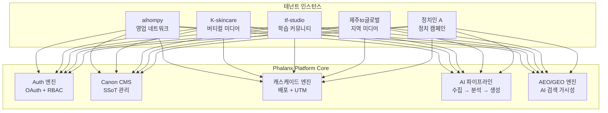

# Phalanx → 범용 AEO/GEO 캐스케이드 플랫폼 전략

> **핵심 통찰:** Phalanx의 아키텍처는 "정치 여론 관리 시스템"이 아니라,
> **신호 수집 → AI 분석 → 정제된 콘텐츠 → 캐스케이드 배포 → 추적**이라는
> **범용 AEO/GEO 엔진**이다.

---

## 1. 이미 구축된 7개 범용 프리미티브

현재 시스템에 이미 존재하는 핵심 구조를 추상화하면, 어떤 버티컬에도 재사용 가능한 **7개 프리미티브**가 드러납니다.

```
┌──────────────────────────────────────────────────────────┐
│  ① 신호 수집     ② AI 분석      ③ 정제 콘텐츠(Canon)   │
│  raw_signals     processed_     fact_cards              │
│  scraper.py      signals        expert_contributions    │
│  webhook         GPT-4o         PRINCIPAL 승인          │
├──────────────────────────────────────────────────────────┤
│  ④ 캐스케이드     ⑤ 공론장       ⑥ 역할 계층            │
│  배포             (커뮤니티)      7단계 RBAC             │
│  media_posts     agora          proxy.ts                │
│  UTM 추적        Canon 아카이브  auth-context            │
├──────────────────────────────────────────────────────────┤
│  ⑦ AEO/GEO 파이프라인                                   │
│  ai_search_intents (AI 검색 프로브)                       │
│  → AI 검색 엔진에서 우리 콘텐츠가 인용되는지 추적         │
└──────────────────────────────────────────────────────────┘
```

| # | 프리미티브 | 정치 맥락 | **범용 추상화** |
|:-:|:----------|:---------|:-------------|
| ① | 신호 수집 | 커뮤니티 여론 스크래핑 | **시장 인텔리전스 수집** |
| ② | AI 분석 | 위협 감성·의제 군집 | **트렌드·니즈 분석 엔진** |
| ③ | Canon | 공식 입장 팩트카드 | **브랜드 SSoT (Single Source of Truth)** |
| ④ | 캐스케이드 | 참여자 소셜 배포 | **분산 배포 네트워크** |
| ⑤ | 공론장 | 시민 Q&A 아고라 | **커뮤니티 인게이지먼트 허브** |
| ⑥ | 역할 계층 | SYSOP→CITIZEN | **조직 거버넌스 엔진** |
| ⑦ | AEO/GEO | AI 검색 인용 추적 | **AI 시대 검색 가시성 관리** |

---

## 2. 4개 버티컬 적용 맵

### 2-A. 영업 조직 네트워크 (aihompy 판매/운영)

```
정치 용어           →    영업 조직 대응
─────────────           ──────────────
PRINCIPAL (정치인)  →    본사 (브랜드 오너)
STRATEGIST (참모)   →    영업 기획팀
REGION_LEAD (조직장) →   지역 총판/팀장
ACTIVIST (활동가)    →   현장 영업사원/리셀러
CITIZEN (시민)      →    잠재 고객

fact_cards          →    제품 공식 세일즈 스크립트
media_posts         →    영업사원 소셜 셀링 콘텐츠
raw_signals         →    고객 VOC·경쟁사 동향
ai_search_intents   →    "AI 검색에서 우리 제품이 추천되는가?"
agora               →    고객 후기·FAQ 포털
```

**킬러 기능 추가 필요:**

| 기능 | 내용 | 킬러 포인트 |
|:-----|:-----|:-----------|
| **세일즈 스크립트 AI 변환** | 공식 제품 설명 → 카카오톡/인스타 DM용 자동 변환 | 영업사원이 복붙만 하면 전문 마케터 수준 |
| **리드 추적 연동** | UTM 클릭 → CRM 리드 자동 등록 | 어떤 영업사원이 어떤 고객을 데려왔는지 |
| **성과 리더보드** | 지역별/개인별 배포→클릭→전환 랭킹 | 영업 조직 경쟁 유도 |
| **경쟁사 가격 모니터** | 경쟁사 신호 수집 → 대응 스크립트 자동 생성 | 실시간 경쟁 대응 |
| **커미션 트래커** | media_clicks → 전환 → 커미션 정산 | 분산 영업의 핵심 인센티브 |

---

### 2-B. 버티컬 미디어 포털 (K-skincare 등)

```
정치 용어           →    버티컬 미디어 대응
─────────────           ──────────────
PRINCIPAL           →    미디어 편집장
EXPERT              →    전문 칼럼니스트 / KOL
STRATEGIST          →    에디터·큐레이터
ACTIVIST            →    앰배서더·리뷰어
CITIZEN             →    일반 독자

fact_cards          →    에디토리얼 Canon (검증된 정보)
raw_signals         →    트렌드 키워드·SNS 버즈
clusters            →    트렌드 군집 (예: "시카 성분 트렌드")
agora               →    독자 Q&A / 제품 토론장
ai_search_intents   →    "ChatGPT가 K-skincare를 어떻게 설명하는가?"
```

**킬러 기능 추가 필요:**

| 기능 | 내용 | 킬러 포인트 |
|:-----|:-----|:-----------|
| **AEO 콘텐츠 최적화기** | Canon 콘텐츠를 AI 검색 인용에 최적화된 구조로 자동 포맷 | AI 검색에서 1순위 인용 |
| **KOL 기고 마켓플레이스** | EXPERT 역할 확장 → 기고 요청·보상 워크플로 | 전문가 콘텐츠 수급 자동화 |
| **제품 DB + 성분 분석기** | 구조화된 제품 메타데이터 → AI 비교 분석 | "내 피부 타입에 맞는 추천" |
| **앰배서더 UGC 캐스케이드** | 리뷰어가 공식 콘텐츠 기반 UGC 생성 → UTM 추적 | 체계적 입소문 마케팅 |
| **트렌드 예측 리포트** | processed_signals → 주간 트렌드 예측 자동 생성 | 유료 구독 수익 모델 |

---

### 2-C. 학습 커뮤니티 (tf-studio 등)

```
정치 용어           →    학습 커뮤니티 대응
─────────────           ──────────────
PRINCIPAL           →    학원장 / 교육 디렉터
EXPERT              →    강사·멘토
STRATEGIST          →    커리큘럼 기획자
REGION_LEAD         →    반장·그룹 리더
ACTIVIST            →    수강생 (활동형)
CITIZEN             →    체험 수강생 / 잠재 고객

fact_cards          →    학습 핵심 개념 카드 (Knowledge Canon)
media_posts         →    수강생 학습 인증 + 소셜 공유
raw_signals         →    수강생 질문·피드백·난이도 시그널
agora               →    Q&A 게시판 / 스터디 그룹
```

**킬러 기능 추가 필요:**

| 기능 | 내용 | 킬러 포인트 |
|:-----|:-----|:-----------|
| **학습 경로 엔진** | Canon 카드 연결 → 자동 커리큘럼 시퀀스 | 개인화 학습 경로 |
| **AI 튜터 (Canon RAG)** | 승인된 학습 카드 기반 AI 질의응답 | 강사 답변과 동일한 품질 보장 |
| **학습 인증 캐스케이드** | 수강생이 "오늘 배운 것" 소셜 공유 → UTM 추적 | 자연스러운 바이럴 모집 |
| **퀴즈·과제 엔진** | fact_cards → 자동 퀴즈 생성 (GPT) | 학습 확인 자동화 |
| **수료증 NFT/PDF** | pod_logs 기반 학습 증명서 자동 발급 | 포트폴리오 증빙 |

---

### 2-D. 지역 커뮤니티 미디어 (제주to글로벌 등)

```
정치 용어           →    지역 커뮤니티 대응
─────────────           ──────────────
PRINCIPAL           →    지역 미디어 대표
EXPERT              →    지역 전문가·기자
STRATEGIST          →    편집국장
REGION_LEAD         →    마을 리포터 / 동네 에디터
ACTIVIST            →    시민 기자
CITIZEN             →    지역 주민·방문객

fact_cards          →    지역 정보 Canon (맛집, 행사, 정책)
raw_signals         →    지역 SNS 버즈 + 관광객 리뷰
clusters            →    지역 이슈 군집 ("제주 쓰레기 문제")
media_posts         →    시민 기자 배포 콘텐츠
agora               →    주민 의견·제안 게시판
```

**킬러 기능 추가 필요:**

| 기능 | 내용 | 킬러 포인트 |
|:-----|:-----|:-----------|
| **지역 정보 지도 (GeoCanon)** | fact_cards + 위치 좌표 → 인터랙티브 지도 | 관광·생활 정보 통합 |
| **다국어 자동 번역** | Canon → 영어/일본어/중국어 자동 번역 (GPT) | "to글로벌" 비전 실현 |
| **지역 행사 캘린더** | 지역 이벤트 크롤링 → 통합 캘린더 | 주민+관광객 모두 유용 |
| **시민 제보 채널** | 텔레그램 봇 → raw_signals → 편집국 대시보드 | 시민 참여 저널리즘 |
| **지역 광고 마켓** | 로컬 비즈니스 → 커뮤니티 내 타겟 광고 | 자생적 수익 모델 |

---

## 3. 킬러앱화를 위한 12개 범용 모듈

버티컬을 관통하는 공통 필요 기능을 **3개 티어**로 분류합니다.

### Tier 1 — 플랫폼 코어 (모든 버티컬 필수)

| # | 모듈 | 현재 상태 | 추가 개발 |
|:-:|:-----|:---------|:---------|
| 1 | **멀티테넌트 엔진** | 단일 인스턴스 | 테넌트 설정 DB + 화이트라벨 테마 |
| 2 | **실제 Auth** | localStorage mock | Supabase Auth + 카카오/구글 OAuth |
| 3 | **AEO/GEO 대시보드** | ai_search_intents 기본 | 키워드별 AI 인용률 추이 + 경쟁사 비교 |
| 4 | **Canon CMS** | 팩트카드 기본 | 리치 에디터 + 버전 관리 + SEO 메타 자동생성 |

### Tier 2 — 버티컬 가속기 (차별화 기능)

| # | 모듈 | 적용 버티컬 | 핵심 가치 |
|:-:|:-----|:-----------|:---------|
| 5 | **캐스케이드 자동화** | 전체 | 소셜 API 직접 게시 + 예약 발송 |
| 6 | **AI 콘텐츠 변환기** | 전체 | Canon → 채널별 포맷 원클릭 변환 |
| 7 | **리드/전환 트래커** | 영업·미디어 | UTM → CRM 연동 + 어트리뷰션 |
| 8 | **커뮤니티 게이미피케이션** | 학습·지역 | 포인트·배지·리더보드·성장 경로 |
| 9 | **구조화 데이터 엔진** | 미디어·지역 | 제품DB·장소DB → Schema.org 자동 마크업 |

### Tier 3 — 네트워크 효과 (규모 확장)

| # | 모듈 | 내용 | 잠금 해제 조건 |
|:-:|:-----|:-----|:-------------|
| 10 | **크로스 테넌트 Canon 신디케이션** | A 테넌트의 Canon이 B 테넌트에서 인용 | 3개+ 테넌트 |
| 11 | **분산 기자단/앰배서더 마켓** | 테넌트 간 EXPERT 공유 | KOL 풀 구축 |
| 12 | **통합 AEO 벤치마크** | 테넌트 간 AI 인용률 비교 | 데이터 축적 |

---

## 4. 멀티테넌트 아키텍처 제안



**테넌트 분리 방식:**

| 방식 | 장점 | 단점 | 권장 |
|:-----|:-----|:-----|:-----|
| DB별 분리 (Supabase 프로젝트별) | 완전 격리, 보안 최강 | 관리 복잡 | 대형 고객 |
| 스키마별 분리 (tenant_id 컬럼) | 관리 단순, 크로스 쿼리 | RLS 복잡 | **기본 권장** |
| 하이브리드 | 소형은 공유, 대형은 분리 | 아키텍처 이중 | 스케일 후 |

---

## 5. AEO/GEO 킬러 기능 상세

> AEO(AI Engine Optimization)와 GEO(Generative Engine Optimization)는
> "AI 검색 엔진에서 우리 콘텐츠가 인용되는 것"을 최적화하는 차세대 SEO입니다.

### 현재 보유 기반

```
ai_search_intents 테이블
├── keyword: 추적 키워드
├── stage: AWARENESS / EVALUATION / DECISION
├── citation_type: POSITIVE / NEUTRAL / NEGATIVE / NOT_MENTIONED
└── ai_search_probe.py: GPT/Perplexity에 질의 → 인용 여부 추적
```

### 킬러 기능으로 발전시키려면

| 기능 | 내용 | 모든 버티컬 공통 가치 |
|:-----|:-----|:-------------------|
| **AI 인용률 대시보드** | 키워드별 "우리가 인용되는 비율" 추이 차트 | SEO → AEO 전환의 핵심 KPI |
| **경쟁사 인용 비교** | 동일 키워드로 경쟁자가 인용되는 빈도 | 차별화 포인트 식별 |
| **Canon 구조 최적화기** | AI가 인용하기 쉬운 형태로 콘텐츠 자동 리포맷 | 인용률 2-3배 향상 |
| **Schema.org 자동 마크업** | FAQ, HowTo, Product 등 구조화 데이터 | AI 크롤러 파싱 최적화 |
| **인용 알림** | "ChatGPT가 오늘 우리 콘텐츠를 인용했습니다" | 성과 실시간 확인 |
| **A/B Canon 테스트** | 같은 주제, 다른 구조의 Canon → 인용률 비교 | 데이터 기반 콘텐츠 최적화 |

---

## 6. 실행 로드맵

```
Phase A (NOW)         Phase B (1~2개월)     Phase C (3~4개월)       Phase D (6개월+)
────────────         ────────────          ────────────            ────────────
현재 정치 버티컬     멀티테넌트 코어       첫 2개 버티컬 론칭       네트워크 효과
완성                 구축                  aihompy + K-skincare    크로스 테넌트

· Supabase Auth      · tenant_id 분리      · 세일즈 스크립트       · Canon 신디케이션
· 소셜 API 연동      · 화이트라벨 테마      · KOL 마켓플레이스      · 앰배서더 마켓
· AEO 대시보드       · Canon CMS 범용화    · 리드 트래커           · 통합 AEO 벤치마크
                     · 역할 라벨 커스텀화   · 제품 DB 엔진
```

---

## 7. 결론: 왜 이것이 킬러앱인가

```
전통 SEO 시대                    AI 검색 시대 (AEO/GEO)
─────────────                    ─────────────────────
블로그 포스팅 → 구글 랭킹        Canon SSoT → AI 인용
개인 SNS 홍보                    캐스케이드 네트워크 배포
수동 트렌드 분석                  AI 자동 신호 수집·분석
단일 채널 운영                    6채널 동시 배포 + UTM 추적
```

> [!IMPORTANT]
> **Phalanx의 진짜 자산은 코드가 아니라 구조입니다.**
>
> 1. **Canon (정제된 SSoT)** → AI가 인용할 수 있는 신뢰 콘텐츠
> 2. **캐스케이드 네트워크** → 조직원이 자발적으로 배포하는 분산 구조
> 3. **AI 파이프라인** → 수집→분석→생성→배포 전 주기 자동화
> 4. **AEO 추적** → "AI 검색에서 우리가 보이는가?" 측정 가능
>
> 이 4가지가 결합된 플랫폼은 현재 시장에 **존재하지 않습니다.**
> 각 요소는 개별 SaaS로 있지만, 통합된 형태는 Phalanx가 유일합니다.
